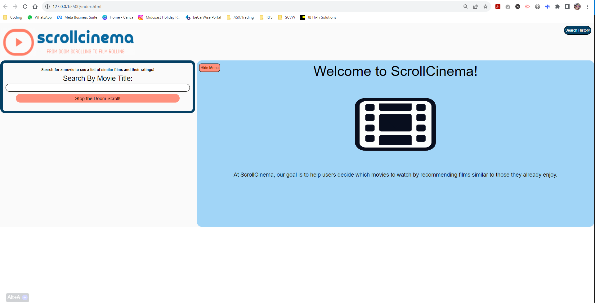

# P1-ScrollCinema

## Description

The aim of this challenge was work as a team with a group of fellow students to create, build and deploy a front-end application to address a real world problem.

Our idea was to develop a tool that allows the user to input a particular movie (one they didn't want to watch) and use API's to suggest 5 similar movie titles. 

While this is commonly done on individual streaming platforms, our app gives the user the ability to search across OMDB and TMBD databases, so they are given a wider range of options. 

In addition to movie suggestions, the app show the official movie poster, Ratings (Rotten Tomatoes, OMDB) and a synopsis of the plot.

In future updates, we hope to add more information options like social media reviews, trailer links and streaming options.

## Usage

The link to access the website and a screenshot of the page is below...

https://danyon-talbot.github.io/P1-ScrollCinema/

## Credits

This project was imagined and created by: Issac Masterman, Neil Reddy, Peta Swan and Danyon Talbot.

API's used in the project - 
TMDB - https://www.themoviedb.org/?language=en-AU
OMDB - https://www.omdbapi.com/

